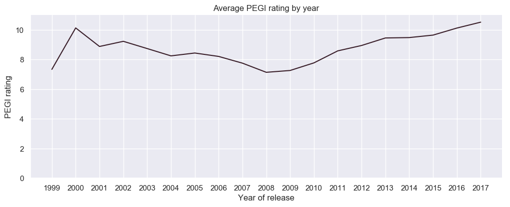
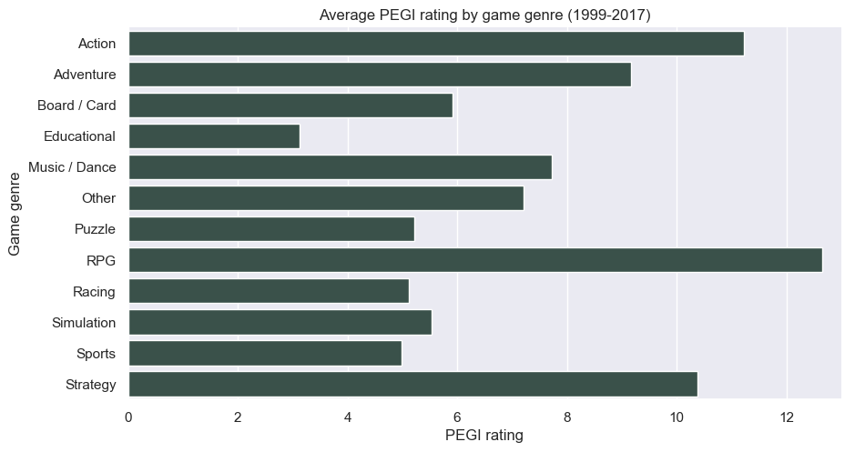
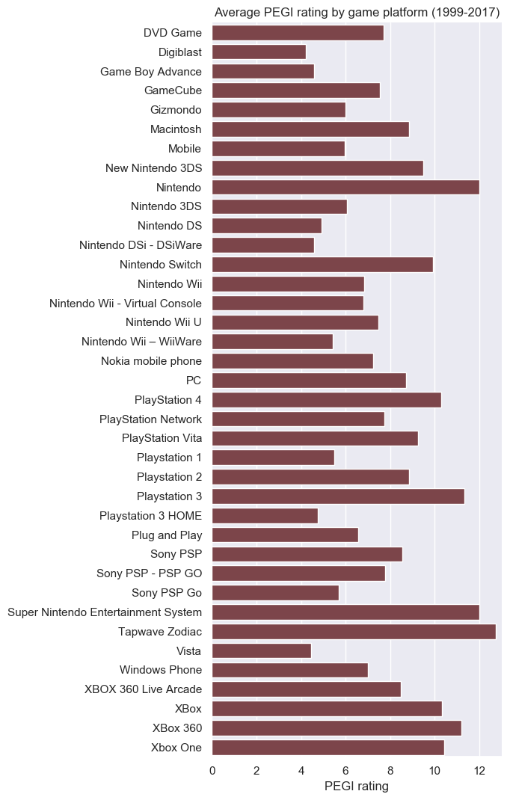

# PEGI ratings

27,957 PEGI ratings scraped from http://pegi.info/ on 7 September 2017, using the rvest package for R.

Available data includes:

* Game title
* PEGI rating
* Platform
* Genre
* Release date

> Pan European Game Information (PEGI, pronounced "Peggy") is a European video game content rating system established to help European consumers make informed decisions when buying video games or apps through the use of age recommendations and content descriptors. It was developed by the Interactive Software Federation of Europe (ISFE) and came into use in April 2003; it replaced many national age rating systems with a single European system. The PEGI system is now used in more than thirty countries and is based on a code of conduct, a set of rules to which every publisher using the PEGI system is contractually committed. PEGI self-regulation is composed by five age categories and eight content descriptors that advise the suitability and content of a game for a certain age range based on the games content. The age rating is not intended to indicate the difficulty of the game or the skill required to play it.

